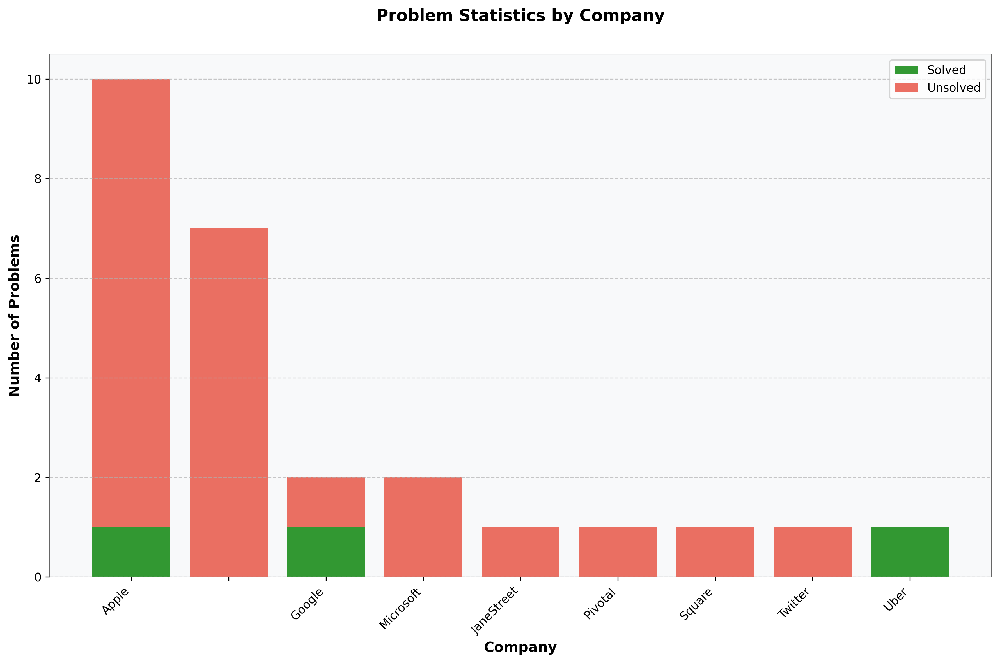

# Daily Coding Problem

### 🏆 Problems List

<!-- START PROBLEMS TABLE -->
| Problem | Companies | Difficulty | Status |
|---------|-----------|------------|--------|
| [Daily Coding Problem: Problem #273](https://github.com/Razeen-Shaikh/dailyCodingProblem/issues/27) |  |  |  |
| [Daily Coding Problem: Problem #266](https://github.com/Razeen-Shaikh/dailyCodingProblem/issues/26) |  |  |  |
| [Daily Coding Problem: Problem #233](https://github.com/Razeen-Shaikh/dailyCodingProblem/issues/25) |  |  |  |
| [Daily Coding Problem: Problem #210](https://github.com/Razeen-Shaikh/dailyCodingProblem/issues/24) |  |  |  |
| [Daily Coding Problem: Problem #196](https://github.com/Razeen-Shaikh/dailyCodingProblem/issues/23) |  |  |  |
| [Daily Coding Problem: Problem #162](https://github.com/Razeen-Shaikh/dailyCodingProblem/issues/22) |  |  |  |
| [Daily Coding Problem: Problem #148](https://github.com/Razeen-Shaikh/dailyCodingProblem/issues/21) |  |  |  |
| [Daily Coding Problem: Problem #135](https://github.com/Razeen-Shaikh/dailyCodingProblem/issues/20) |  |  |  |
| [Daily Coding Problem: Problem #93](https://github.com/Razeen-Shaikh/dailyCodingProblem/issues/19) |  |  |  |
| [Daily Coding Problem: Problem #74](https://github.com/Razeen-Shaikh/dailyCodingProblem/issues/18) |  |  |  |
| [Daily Coding Problem: Problem #53](https://github.com/Razeen-Shaikh/dailyCodingProblem/issues/17) |  |  |  |
| [Daily Coding Problem: Problem #33](https://github.com/Razeen-Shaikh/dailyCodingProblem/issues/16) |  |  |  |
| [Daily Coding Problem #32](https://github.com/Razeen-Shaikh/dailyCodingProblem/issues/15) |  |  |  |
| [Daily Coding Problem #22](https://github.com/Razeen-Shaikh/dailyCodingProblem/issues/2) |  |  |  |
| [Daily Coding Problem #14](https://github.com/Razeen-Shaikh/dailyCodingProblem/issues/13) |  |  |  |
| [Daily Coding Problem #11](https://github.com/Razeen-Shaikh/dailyCodingProblem/issues/14) |  |  |  |
| [Daily Coding Problem #9 [Hard]](https://github.com/Razeen-Shaikh/dailyCodingProblem/issues/11) |  |  |  |
| [Daily Coding Problem #8 [Easy]](https://github.com/Razeen-Shaikh/dailyCodingProblem/issues/10) |  |  |  |
| [Daily Coding Problem #7 [Medium]](https://github.com/Razeen-Shaikh/dailyCodingProblem/issues/9) |  |  |  |
| [Daily Coding Problem #6 [Hard]](https://github.com/Razeen-Shaikh/dailyCodingProblem/issues/8) |  |  |  |
| [Daily Coding Problem #5 [Medium]](https://github.com/Razeen-Shaikh/dailyCodingProblem/issues/7) |  |  |  |
| [Daily Coding Problem #4 [Hard]](https://github.com/Razeen-Shaikh/dailyCodingProblem/issues/6) |  |  |  |
| [Daily Coding Problem: Problem #3 [Medium]](https://github.com/Razeen-Shaikh/dailyCodingProblem/issues/5) |  |  |  |
| [Array Product Except Self](https://github.com/Razeen-Shaikh/dailyCodingProblem/issues/4) |  |  |  |
| [Job Scheduler](https://github.com/Razeen-Shaikh/dailyCodingProblem/issues/12) |  |  |  |
| [Two Sum](https://github.com/Razeen-Shaikh/dailyCodingProblem/issues/3) |  |  |  |
<!-- END PROBLEMS TABLE -->

### 📊 Problem Statistics

<!-- stats-start -->

<table>
<tr>
    <td style="vertical-align: top; padding-right: 20px;">
    <table>
        <tr><th width="25%">Company</th><th width="25%">Total</th><th width="25%">Solved</th><th>Unsolved</th></tr>
<tr><td>Apple</td><td>10</td><td>✅ 1</td><td>❌ 9</td></tr>
<tr><td></td><td>7</td><td>❌ 0</td><td>❌ 7</td></tr>
<tr><td>Google</td><td>2</td><td>✅ 1</td><td>❌ 1</td></tr>
<tr><td>Microsoft</td><td>2</td><td>❌ 0</td><td>❌ 2</td></tr>
<tr><td>JaneStreet</td><td>1</td><td>❌ 0</td><td>❌ 1</td></tr>
<tr><td>Pivotal</td><td>1</td><td>❌ 0</td><td>❌ 1</td></tr>
<tr><td>Square</td><td>1</td><td>❌ 0</td><td>❌ 1</td></tr>
<tr><td>Twitter</td><td>1</td><td>❌ 0</td><td>❌ 1</td></tr>
<tr><td>Uber</td><td>1</td><td>✅ 1</td><td>✅ 0</td></tr>
</table>
    </td>
    <td style="text-align: center;">
        
    </td>
</tr>
</table>

<!-- stats-end -->

